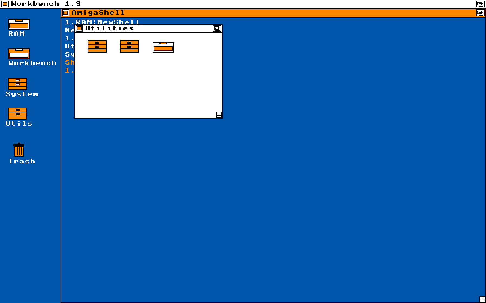

# Omarchy Workbench 1.3

Kickstart / Workbench 1.3 for [Omarchy](https://omarchy.org/): Amiga blue field, white type, black structure, orange highlight. Not Workbench 2.x grey.



## Install (full theme)

Omarchy’s `theme install` clones the repo *with* `.git`, then drops Lua (so floating windows, border resize, and Hyprland extras would not apply). Use this instead:

```bash
git clone https://github.com/perlausten/omarchy-workbench-1.3-theme.git
cd omarchy-workbench-1.3-theme
./install.sh
```

That copies the theme **without** `.git` to `~/.config/omarchy/themes/workbench-1.3`, installs the `theme-set` hooks, and runs `omarchy theme set workbench-1.3`.

If you already ran `omarchy theme install` on this URL, run `./install.sh` from the cloned theme directory. It removes `.git` and re-applies so Lua and hooks take effect.

## What you get

- Four OCS pens (`#0055AA`, `#FFFFFF`, `#000000`, `#FF8800`) plus a few 12-bit cousins for terminals
- Opaque Workbench chrome: white screen-bar, orange selected rows, lock requester
- Floating overlapping windows, orange/black borders, resize by dragging the border
- Topaz Unicode KS13 at 16px while this theme is current
- GTK3/GTK4 stylesheet (Files and other GTK apps)
- 4-color file icons (other icons fall back to Yaru-blue)
- Authentic WB 1.3 red pointer (see [THIRD_PARTY.md](THIRD_PARTY.md))
- Starship prompt with AmigaShell `>`

Switching away restores the previous font, cursor, icons, GTK CSS, and Starship config.

## Colour-only install

```bash
omarchy theme install https://github.com/perlausten/omarchy-workbench-1.3-theme.git
```

That keeps `colors.toml`, `shell.toml`, wallpapers, and icons.theme, but **not** `hyprland.lua`. Prefer `./install.sh` for the full desktop.

## License

Original work: [MIT](LICENSE). Cursors and Topaz: [THIRD_PARTY.md](THIRD_PARTY.md).
